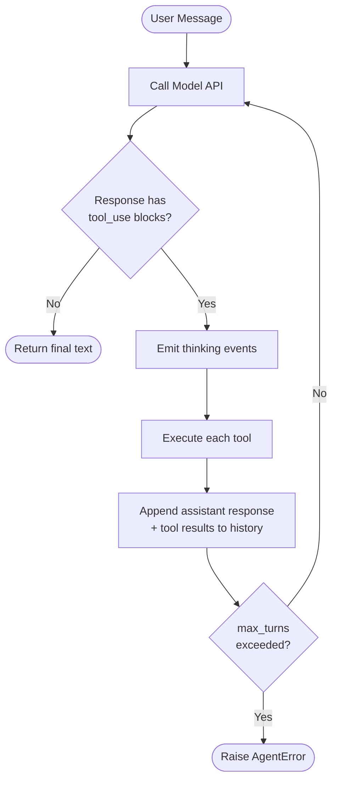
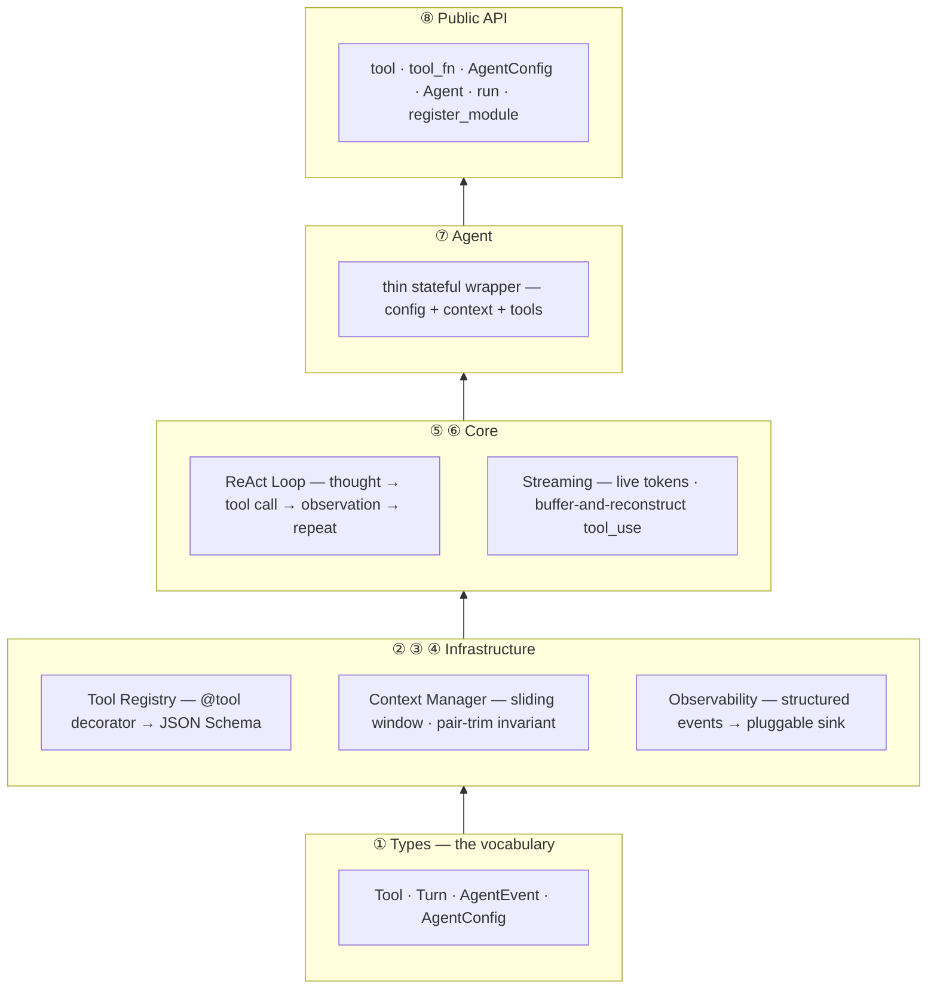
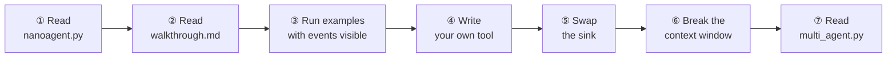

<div align="center">

# nanoagent

**The irreducible AI agent reasoning engine.**

≤300 lines · one dependency · complete AI agent

[](LICENSE)
[](https://python.org)
[](nanoagent.py)
[](https://pypi.org/project/openai/)

[Quickstart](#quickstart) · [The Loop](#the-react-loop) · [Architecture](#architecture) · [Why](#why) · [Learning Path](#learning-path) · [Examples](#examples) · [Reference](#reference)

</div>

---

No LangChain. No LangGraph. No abstractions between you and the model.

Read it in 20 minutes. Understand agents completely.

---

## Quickstart

```python
from nanoagent import tool, run

@tool
def add(a: int, b: int) -> int:
    """Add two numbers."""
    return a + b

print(run("What is 1337 + 42?"))
```

```bash
pip install openai
export OPENAI_API_KEY=your_key_here
```

Or with `uv`:

```bash
uv add openai
uv run examples/hello_tool.py
```

**Other providers** — any OpenAI-compatible endpoint works via `AgentConfig`:

```python
from nanoagent import Agent, AgentConfig

# Groq
agent = Agent(config=AgentConfig(model="llama-3.3-70b-versatile",
    base_url="https://api.groq.com/openai/v1", api_key="gsk_..."))

# Ollama (local, free)
agent = Agent(config=AgentConfig(model="llama3.2",
    base_url="http://localhost:11434/v1", api_key="ollama"))
```

---

## The ReAct Loop

Every agent framework runs this pattern at its core. nanoagent exposes it
directly — no wrappers, no framework, just the loop.



This is what LangGraph, CrewAI, and AutoGen all do under the hood.
Once you can read `_react_loop()` at line 157 and explain each step
out loud, you understand agents.

---

## Architecture

`nanoagent.py` is structured in 8 sections that build on each other:



---

## Why

When building AI solutions you start to notice the same patterns — in the
tools you use and in the code you write yourself. The pattern is simple.
But frameworks bury it under abstractions, configs, and layers of indirection
that obscure more than they clarify.

nanoagent is what happens when you strip all of that away. One file. One
dependency. No noise. The pattern, plainly.

The ≤300-line constraint is a forcing function: every line that doesn't earn
its place gets cut. What's left is the thing itself, readable end-to-end in
20 minutes.

---

## Understanding the Code

**[docs/walkthrough.md](docs/walkthrough.md)** is the companion to reading
`nanoagent.py`. It covers:

- The ReAct pattern — what it is and why it works
- Each of the 8 sections in depth, with the reasoning behind every decision
- A step-by-step execution trace of a real example
- What nanoagent deliberately doesn't do, and why

If you want to actually understand how agents work, read the walkthrough
alongside the source. It's the point of the project.

---

## Learning Path



**① Read the source first (20 min)**

Open `nanoagent.py` top-to-bottom once, then open `docs/walkthrough.md`
alongside it. The walkthrough explains *why* each section is shaped the
way it is — not just what it does.

**② Run the examples with events visible**

The JSON events print to stderr. Separate streams to see them clearly:

```bash
python examples/web_researcher.py 2>/tmp/events.json
cat /tmp/events.json
```

Or watch live in a split terminal:

```bash
python examples/web_researcher.py 1>/dev/null   # events only
```

**③ Write your own tool (the real lesson)**

This is where it clicks. Write a file and run it:

```python
from nanoagent import tool, run

@tool
def word_count(text: str) -> int:
    """Count the number of words in a string."""
    return len(text.split())

@tool
def reverse(text: str) -> str:
    """Reverse a string."""
    return text[::-1]

print(run("Reverse the phrase 'hello world' and then count its words"))
```

Watch the model decide which tools to call and in what order — without
you telling it.

**④ Swap the observability sink**

The sink is pluggable. Try capturing events instead of printing them:

```python
import json
from nanoagent import tool, AgentConfig, Agent, AgentEvent

log = []

def capturing_sink(event: AgentEvent) -> None:
    log.append({"ts": event.ts, "type": event.type, **event.payload})

@tool
def add(a: int, b: int) -> int:
    """Add two numbers."""
    return a + b

agent = Agent(config=AgentConfig(sink=capturing_sink))
agent.run("What is 99 + 1?")
print(json.dumps(log, indent=2))  # full structured trace
```

**⑤ Break the context window intentionally**

Have a long multi-turn conversation and watch `context_trimmed` events
appear. Then look at `ContextManager.trim()` (line 115) to see exactly
what gets dropped and why.

**⑥ Read `multi_agent.py` last**

Once you understand a single agent, the multi-agent example shows how one
agent becomes a tool on another — the architecture pattern behind every
production multi-agent system.

---

## Examples

| Example | Demonstrates |
|---------|-------------|
| `examples/hello_tool.py` | Minimal: one tool, one question |
| `examples/web_researcher.py` | Multi-tool chaining (search + fetch + summarize) |
| `examples/code_executor.py` | Model writes and runs its own Python code |
| `examples/multi_agent.py` | Two agents — one registered as a tool on the other |
| `examples/hitl_agent.py` | Human-in-the-loop via a blocking stdin tool |

---

## Reference

<details>
<summary><strong>Public API</strong></summary>

```python
# Decorator: register a function as a tool
@tool
def my_tool(x: str) -> str: ...

# Explicit registration
@tool_fn("name", "description", input_schema)
def my_tool(x: str) -> str: ...

# Configuration
config = AgentConfig(model="gpt-4o", max_turns=20, system="...",
                     base_url="https://api.groq.com/openai/v1",  # optional
                     api_key="...")                               # optional

# Multi-turn agent
agent = Agent(tools=[...], config=config)
response = agent.run("message")
agent.reset()

# One-shot convenience
response = run("message", tools=[...], system="...", stream=True)

# Register all tools from a module
count = register_module(my_module)
```

</details>

<details>
<summary><strong>Design Decisions</strong></summary>

- **Single file**: The artifact is the education. `nanoagent.py` top-to-bottom is the tutorial.
- **≤300 lines**: Forces prioritization. Every line earns its place.
- **One dependency**: `anthropic` only. No hidden complexity from transitive deps.
- **ReAct pattern**: Thought → action → observation. The simplest complete reasoning loop.
- **Pluggable sink**: Production observability without changing the core.
- **Pair-trim**: Preserves the Anthropic API's role-alternation invariant automatically.

</details>

---

## Tests

```bash
pytest tests/
```

40 tests across 5 files. No real API calls — mocked throughout.

---

## License

MIT
